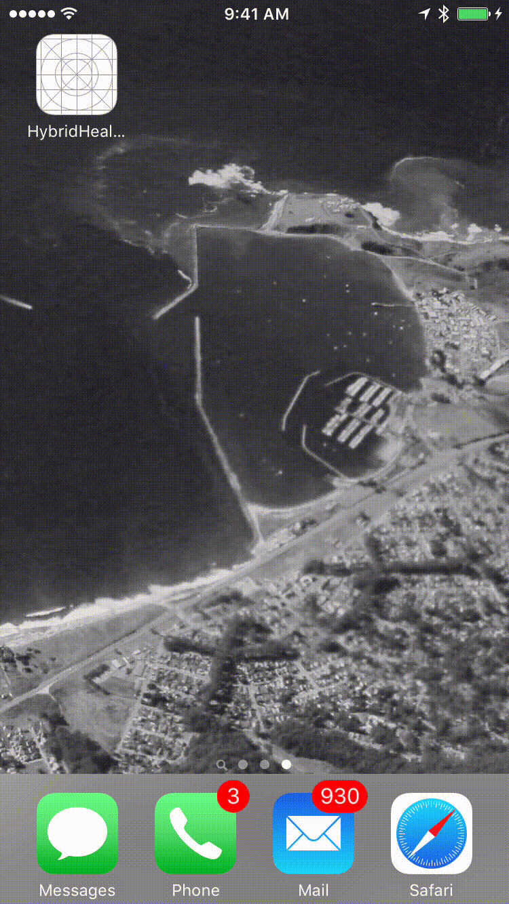

# HealthKit Distance Histogram Proofs

This is a collection of several proof of concepts built on HealthKit. This code is the product of early spikes and iterations since late 2014 as both HealthKit and the Swift language have been settling.

## Distance Histogram - Master Detail

This application is based on the original Master Detail application seed of a "Hybrid Health Store".

The use case is the user is interested in generating a histogram of their step count or Distance Walking/Running samples stored in the iOS Health Store and available by way of the HealthKit API. The Distance Walking/Running settled out as a more intuitive measure of activity in the first spike or iteration of this app.

## Design Inventory

- Master Detail approach as a user interaction experiment
- HealthKit with Health Kit Provider layer to coordinate data queries
- Data Provider to provide a very rough local store
- Data plots rendered using ios-charts: https://github.com/danielgindi/ios-charts.git
- Biometrics Provider to provide Touch ID. Minor issue with auto layout thread interference fixed with a dispatch_async block.

## Screen Transitions

- Reference the clip below for a walkthrough of of Distance Histogram, Master Detail works in progress concept proof.

## Next Steps

- Revise or, more likely, replace the current Master Detail approach
- Instead of primitive Action sheet based selection of plot variant - auto generate a batch of plots and display using Stack View. Related - provide flexibility to select NSDates - to and from.
- Refactor and streamline Data Provider data store and interface
- Refactor the "external data handler" away from the Master view controller to a more natural place for the distilled data capture from HK query
- Generate a text readable representation of the HealthKit samples in JSON format, and potentially even save and export the rendered data plot as a JPEG or PNG image.
- Encrypt local data stored by application as well as exported data.

# Reference Code:

-[SwiftlyJSON](https://github.com/SwiftyJSON/SwiftyJSON)
-[ios-charts](https://github.com/danielgindi/ios-charts.git)
-[RNCryptor](https://github.com/RNCryptor/RNCryptor)
